<div align="center">


### [](https://git.io/typing-svg)


### 🥛|**ANG**|🥛HERE


[](mailto:ANGJustinl@163.com)
[](https://qm.qq.com/cgi-bin/qm/qr?k=mcs-cON_aPNfc3hO8-H7lWJHDX-5nKr7&noverify=0)


✨STUDENT 

</div>

---

### 🎨USING


<a href="#">
  
</a>


### 📊*Statistic* 

<details>

<p align="center">
   
</p>

[](https://github.com/ANGJustinl/ANGJustinl)

</details>

<!--START_SECTION:waka-->


**I'm an Early 🐤** 

```text
🌞 Morning                414 commits         ███████░░░░░░░░░░░░░░░░░░   29.87 % 
🌆 Daytime                415 commits         ███████░░░░░░░░░░░░░░░░░░   29.94 % 
🌃 Evening                514 commits         █████████░░░░░░░░░░░░░░░░   37.09 % 
🌙 Night                  43 commits          █░░░░░░░░░░░░░░░░░░░░░░░░   03.10 % 
```


📊 **This Week I Spent My Time On** 

```text
🕑︎ Time Zone: Asia/Shanghai

💬 Programming Languages: 
Other                    4 hrs 11 mins       ███████████████████████░░   90.12 % 
Python                   24 mins             ██░░░░░░░░░░░░░░░░░░░░░░░   08.93 % 
TOML                     1 min               ░░░░░░░░░░░░░░░░░░░░░░░░░   00.65 % 
Git                      0 secs              ░░░░░░░░░░░░░░░░░░░░░░░░░   00.19 % 
Markdown                 0 secs              ░░░░░░░░░░░░░░░░░░░░░░░░░   00.11 % 

🔥 Editors: 
Edge                     3 hrs 43 mins       ████████████████████░░░░░   80.00 % 
Bash                     28 mins             ███░░░░░░░░░░░░░░░░░░░░░░   10.08 % 
VS Code                  27 mins             ██░░░░░░░░░░░░░░░░░░░░░░░   09.92 % 

🐱‍💻 Projects: 
clash-verge-rev          2 hrs 6 mins        ███████████░░░░░░░░░░░░░░   45.21 % 
nonebot_plugin_animalVoic55 mins             █████░░░░░░░░░░░░░░░░░░░░   19.80 % 
Terminal                 27 mins             ██░░░░░░░░░░░░░░░░░░░░░░░   09.75 % 
Stapxs-QQ-Lite-2.0       22 mins             ██░░░░░░░░░░░░░░░░░░░░░░░   07.99 % 
LiteLoaderQQNT_Install   22 mins             ██░░░░░░░░░░░░░░░░░░░░░░░   07.91 % 

💻 Operating System: 
Windows                  4 hrs 11 mins       ██████████████████████░░░   89.92 % 
Linux                    28 mins             ███░░░░░░░░░░░░░░░░░░░░░░   10.08 % 
```

**I Mostly Code in Python** 

```text
Python                   9 repos             ██████████░░░░░░░░░░░░░░░   40.91 % 
Go                       4 repos             █████░░░░░░░░░░░░░░░░░░░░   18.18 % 
JavaScript               3 repos             ███░░░░░░░░░░░░░░░░░░░░░░   13.64 % 
HTML                     3 repos             ███░░░░░░░░░░░░░░░░░░░░░░   13.64 % 
Java                     1 repo              █░░░░░░░░░░░░░░░░░░░░░░░░   04.55 % 
```


 Last Updated on 07/04/2024 00:37:20 UTC
<!--END_SECTION:waka-->
