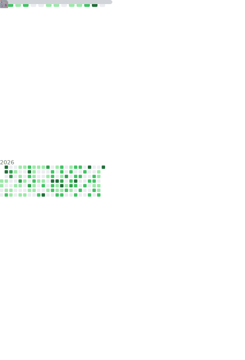

<link rel="stylesheet" href="table{table-layout:fixed;word-break:break-all;}">

<p align="center">
  <picture>
    
  </picture>
</p>


<table align="center">
  <td colspan="6">
    <h2><p align="center">🥛|**ANG**|🥛HERE</h2>
    <p align="center">✨STUDENT</p>
    <p align="center">
    <a href="mailto:ANGJustinl@gmail.com"></a>
    <a href="https://ANGForever.top"></a>
    <a href="https://www.angforever.top"></a>
    </p>
    <div align="center">
      <p>Feel free to contact</p>
        <table>
          <tbody>
            <tr>
              <td align="right" style="padding-right: 10px;"><strong>Python & ML:</strong></td>
              <td>
                
              </td>
            </tr>
            <tr>
              <td align="right" style="padding-right: 10px;"><strong>Platform & Server skills:</strong></td>
              <td>
                
              </td>
            </tr>
            <tr>
              <td align="right" style="padding-right: 10px;"><strong>Git and CI/CD:</strong></td>
              <td>
                
              </td>
            </tr>
            <tr>
              <td align="right" style="padding-right: 10px;"><strong>Other languages:</strong></td>
              <td>
                
              </td>
            </tr>
          </tbody>
        </table>
    </div>
<tbody>
  <tr style="vertical-align: top;">
    <td colspan="3"><a href="https://github.com/anuraghazra/github-readme-stats">
      <picture>
        <source media="(prefers-color-scheme: dark)" srcset="https://github-readme-stats.vercel.app/api?username=ANGJustinl&theme=dark&count_private=true&show_icons=true&hide_border=true&bg_color=0000">
        
      </picture>
    </a></td>
    <td colspan="3"><a href="https://github.com/denvercoder1/github-readme-streak-stats">
      <picture>
        <source media="(prefers-color-scheme: dark)" srcset="https://github-readme-streak-stat-eight.vercel.app/?user=angjustinl&theme=dark&mode=weekly&theme=dark&hide_border=true&background=0000">
        
      </picture>
    </a></td>
  </tr>
</tbody>
<tbody>
 <tr style="vertical-align: top;"> 
   <td colspan="2" style="width: 40%;">
      <a href="https://gitroll.io/profile/uZrqY7KVgYaX4EGtZQSpKAcaT1k52" target="_blank">
        <picture>
          <source media="(prefers-color-scheme: dark)" srcset="https://gitroll.io/api/badges/profiles/v1/uZrqY7KVgYaX4EGtZQSpKAcaT1k52?theme=dark" />
          
        </picture>
      </a>
  </td>

  <td colspan="3" style="width: 60%;">
      <a href="https://next.ossinsight.io/widgets/official/compose-user-dashboard-stats?user_id=96008766" target="_blank" style="display: block" align="center">
        <picture>
          <source media="(prefers-color-scheme: dark)" srcset="https://next.ossinsight.io/widgets/official/compose-user-dashboard-stats/thumbnail.png?user_id=96008766&image_size=auto&color_scheme=dark" width="771" height="auto">
          
        </picture>
      </a>
  </td>

</tr>
</tbody>
<tbody>
  <tr>
    <td colspan="2"><a href="https://github.com/vn7n24fzkq/github-profile-summary-cards">
      <picture>
        <source media="(prefers-color-scheme: dark)" srcset="http://github-profile-summary-cards-mirror.vercel.app/api/cards/repos-per-language?username=angjustinl&theme=default&border_color=0000&bg_color=0000">
        
      </picture>
    </a></td>
    <td colspan="2"><a href="https://github.com/anuraghazra/github-readme-stats">
      <picture>
        <source media="(prefers-color-scheme: dark)" srcset="https://github-readme-stats.vercel.app/api/top-langs/?username=angjustinl&theme=dark&bg_color=0000&hide_border=true&hide=javascript,html,css">
        
      </picture>
    </a></td>
    <td colspan="2"><a href="https://github.com/vn7n24fzkq/github-profile-summary-cards">
      <picture>
        <source media="(prefers-color-scheme: dark)" srcset="http://github-profile-summary-cards-mirror.vercel.app/api/cards/productive-time?username=angjustinl&utcOffset=8&theme=nord_dark&border_color=0000&bg_color=0000">
        
      </picture>
    </a></td>
  </tr>
</tbody>
<tbody>
  <tr>
    <td colspan="3">
      <details>
        <summary> 💻 Waka stats</summary>
<p align="center">

<!--START_SECTION:waka-->


**I'm an Early 🐤** 

```text
🌞 Morning                1748 commits        ██████████░░░░░░░░░░░░░░░   38.97 % 
🌆 Daytime                1299 commits        ███████░░░░░░░░░░░░░░░░░░   28.96 % 
🌃 Evening                1308 commits        ███████░░░░░░░░░░░░░░░░░░   29.16 % 
🌙 Night                  131 commits         █░░░░░░░░░░░░░░░░░░░░░░░░   02.92 % 
```


📊 **This Week I Spent My Time On** 

```text
🕑︎ Time Zone: Asia/Shanghai

💬 Programming Languages: 
Other                    14 hrs 5 mins       █████████████░░░░░░░░░░░░   51.59 % 
Python                   7 hrs 9 mins        ███████░░░░░░░░░░░░░░░░░░   26.25 % 
HTML                     2 hrs 1 min         ██░░░░░░░░░░░░░░░░░░░░░░░   07.43 % 
Lua                      1 hr 25 mins        █░░░░░░░░░░░░░░░░░░░░░░░░   05.21 % 
Bash                     43 mins             █░░░░░░░░░░░░░░░░░░░░░░░░   02.66 % 

🔥 Editors: 
Edge                     14 hrs 2 mins       █████████████░░░░░░░░░░░░   51.43 % 
Antigravity              8 hrs 48 mins       ████████░░░░░░░░░░░░░░░░░   32.24 % 
VS Code                  4 hrs 27 mins       ████░░░░░░░░░░░░░░░░░░░░░   16.33 % 

🐱‍💻 Projects: 
FinAgent                 11 hrs 56 mins      ███████████░░░░░░░░░░░░░░   43.75 % 
user_data                6 hrs 51 mins       ██████░░░░░░░░░░░░░░░░░░░   25.15 % 
MatX_portable            6 hrs 8 mins        ██████░░░░░░░░░░░░░░░░░░░   22.48 % 
openclaw                 53 mins             █░░░░░░░░░░░░░░░░░░░░░░░░   03.29 % 
TabPFN_2                 40 mins             █░░░░░░░░░░░░░░░░░░░░░░░░   02.50 % 

💻 Operating System: 
Windows                  26 hrs 46 mins      █████████████████████████   98.07 % 
Linux                    31 mins             ░░░░░░░░░░░░░░░░░░░░░░░░░   01.93 % 
```

**I Mostly Code in Python** 

```text
Python                   38 repos            ████████████░░░░░░░░░░░░░   48.10 % 
TypeScript               16 repos            █████░░░░░░░░░░░░░░░░░░░░   20.25 % 
JavaScript               8 repos             ███░░░░░░░░░░░░░░░░░░░░░░   10.13 % 
HTML                     6 repos             ██░░░░░░░░░░░░░░░░░░░░░░░   07.59 % 
Shell                    2 repos             █░░░░░░░░░░░░░░░░░░░░░░░░   02.53 % 
```


 Last Updated on 07/03/2026 04:48:30 UTC
<!--END_SECTION:waka-->
</p>      
</td><td colspan="3">
      <details>
        <summary> Github Stats</summary>
<p align="center">

<p align="center">
          
        </p>
      </details>
</td>
</table>
