<div align="center">


### [](https://git.io/typing-svg)


### 🥛|**ANG**|🥛HERE


[](mailto:ANGJustinl@163.com)
[](https://qm.qq.com/cgi-bin/qm/qr?k=mcs-cON_aPNfc3hO8-H7lWJHDX-5nKr7&noverify=0)


✨STUDENT 

</div>

---

### 🎨USING


<a href="#">
  
</a>


### 📊*Statistic* 

<details>

<p align="center">
   
</p>

[](https://github.com/ANGJustinl/ANGJustinl)

</details>

<!--START_SECTION:waka-->


**I'm an Early 🐤** 

```text
🌞 Morning                445 commits         ████████░░░░░░░░░░░░░░░░░   31.65 % 
🌆 Daytime                408 commits         ███████░░░░░░░░░░░░░░░░░░   29.02 % 
🌃 Evening                508 commits         █████████░░░░░░░░░░░░░░░░   36.13 % 
🌙 Night                  45 commits          █░░░░░░░░░░░░░░░░░░░░░░░░   03.20 % 
```


📊 **This Week I Spent My Time On** 

```text
🕑︎ Time Zone: Asia/Shanghai

💬 Programming Languages: 
Python                   3 hrs 17 mins       ████████████░░░░░░░░░░░░░   49.79 % 
Other                    3 hrs 16 mins       ████████████░░░░░░░░░░░░░   49.58 % 
JSON                     2 mins              ░░░░░░░░░░░░░░░░░░░░░░░░░   00.62 % 
Git Config               0 secs              ░░░░░░░░░░░░░░░░░░░░░░░░░   00.00 % 
Markdown                 0 secs              ░░░░░░░░░░░░░░░░░░░░░░░░░   00.00 % 

🔥 Editors: 
VS Code                  4 hrs 2 mins        ███████████████░░░░░░░░░░   61.33 % 
Edge                     2 hrs 29 mins       █████████░░░░░░░░░░░░░░░░   37.71 % 
Bash                     3 mins              ░░░░░░░░░░░░░░░░░░░░░░░░░   00.95 % 

🐱‍💻 Projects: 
nonebot-plugin-sd-comfy  4 hrs 17 mins       ████████████████░░░░░░░░░   65.17 % 
comfyui-api              1 hr 22 mins        █████░░░░░░░░░░░░░░░░░░░░   20.80 % 
plugin-alconna           19 mins             █░░░░░░░░░░░░░░░░░░░░░░░░   04.86 % 
sd-comfy                 11 mins             █░░░░░░░░░░░░░░░░░░░░░░░░   02.90 % 
GIT                      8 mins              █░░░░░░░░░░░░░░░░░░░░░░░░   02.03 % 

💻 Operating System: 
Windows                  6 hrs 31 mins       █████████████████████████   99.05 % 
Linux                    3 mins              ░░░░░░░░░░░░░░░░░░░░░░░░░   00.95 % 
```

**I Mostly Code in Python** 

```text
Python                   10 repos            ███████████░░░░░░░░░░░░░░   43.48 % 
Go                       4 repos             ████░░░░░░░░░░░░░░░░░░░░░   17.39 % 
JavaScript               3 repos             ███░░░░░░░░░░░░░░░░░░░░░░   13.04 % 
HTML                     3 repos             ███░░░░░░░░░░░░░░░░░░░░░░   13.04 % 
Java                     1 repo              █░░░░░░░░░░░░░░░░░░░░░░░░   04.35 % 
```


 Last Updated on 24/04/2024 00:34:09 UTC
<!--END_SECTION:waka-->
